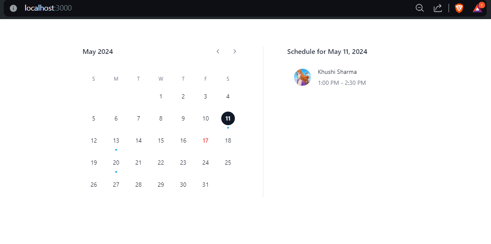

# Calendar App

This is a simple calendar application built with React and Day.js. It allows users to navigate through months, select dates, and view their schedules for selected dates.

## Table of Contents

- [Features](#features)
- [Installation](#installation)
- [Usage](#usage)
- [Styling with Tailwind CSS](#styling-with-tailwind-css)
- [Example Screenshots](#example-screenshots)

## Features
Key Features:
Display of the current month and year.
Navigation between months.
Highlighting the current date.
Indication of selected dates.
Integration with Tailwind CSS for responsive design and styling.

## Installation

To run this application locally, you need to have Node.js installed on your system. Then, follow these steps:
In the project directory, you can run:

### `npm install`
### `npm start`

Runs the app in the development mode.\
Open [http://localhost:3000](http://localhost:3000) to view it in your browser.

The page will reload when you make changes.\
You may also see any lint errors in the console.

## Usage
To use this calendar component in your application:

1. Ensure you have Tailwind CSS installed and configured.
2. Import the Calendar component into your application.
3. Customize the calendar component as needed.

## Styling with Tailwind CSS
Tailwind CSS is used for styling various parts of the calendar component:

Class names: Applied directly to JSX elements to manage layout, spacing, typography, and hover effects.
Responsive design: Utilizes Tailwind's responsive utility classes for a mobile-friendly layout.

## Screenshots

